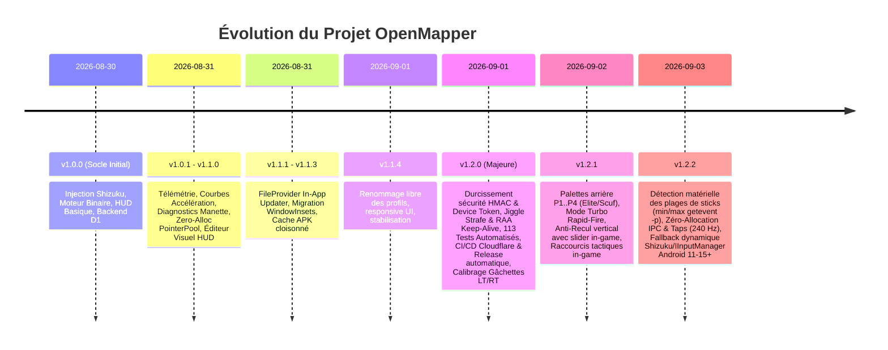
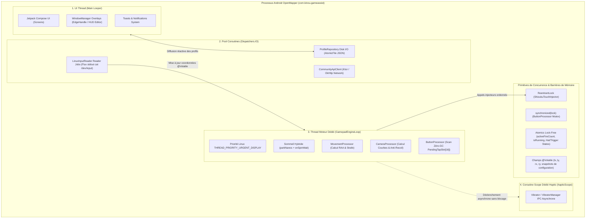

# 🤖 OpenMapper — Guide Technique, Architecture & Décisions d'Ingénierie (`agent.md`)

> **Document de référence pour tout agent d'intelligence artificielle, développeur ou contributeur travaillant sur le projet OpenMapper (`kinou-p/android-open-mapper`).**

---

## 📑 Sommaire
1. [Vue d'Ensemble & Vision du Projet](#1-vue-densemble--vision-du-projet)
2. [Historique & Analyse Évolutive des Commits](#2-historique--analyse-évolutive-des-commits)
3. [Architecture Globale & Modèle de Concurrence Multi-Thread](#3-architecture-globale--modèle-de-concurrence-multi-thread)
   - [3.1 Diagramme Fonctionnel de Bout en Bout](#31-diagramme-fonctionnel-de-bout-en-bout)
   - [3.2 Modèle de Concurrence & Flux Multi-Threads](#32-modèle-de-concurrence--flux-multi-threads)
4. [Architecture Détaillée — Client Android](#4-architecture-détaillée--client-android)
   - [4.1 Moteur Temps Réel & Entrées Bas Niveau (`engine`)](#41-moteur-temps-réel--entrées-bas-niveau-engine)
   - [4.2 Couche d'Injection Tactile (`injector`)](#42-couche-dinjection-tactile-injector)
   - [4.3 Services & Éditeur HUD en Superposition (`service` & `ui/overlay`)](#43-services--éditeur-hud-en-superposition-service--uioverlay)
   - [4.4 Gestion des Données, Sécurité Locale & Mises à Jour (`data`)](#44-gestion-des-données-sécurité-locale--mises-à-jour-data)
   - [4.5 Interface Utilisateur Jetpack Compose (`ui/screens`)](#45-interface-utilisateur-jetpack-compose-uiscreens)
5. [Architecture Détaillée — Backend Cloudflare Workers & D1](#5-architecture-détaillée--backend-cloudflare-workers--d1)
6. [Matrice de Compatibilité Matérielle, Linux Input & Événements Noyau](#6-matrice-de-compatibilité-matérielle-linux-input--événements-noyau)
7. [Pourquoi ces choix ? Rationale, Modèle de Menace & Arbitrages](#7-pourquoi-ces-choix--rationale-modèle-de-menace--arbitrages)
   - [7.1 Tableau des Décisions d'Ingénierie Clés](#71-tableau-des-décisions-dingénierie-clés)
   - [7.2 Modèle de Menace & Philosophie de Sécurité (Threat Model)](#72-modèle-de-menace--philosophie-de-sécurité-threat-model)
8. [Guide de Contribution & Règles Impératives pour les Agents](#8-guide-de-contribution--règles-impératives-pour-les-agents)
9. [Playbook de Diagnostic & Troubleshooting pour les Agents](#9-playbook-de-diagnostic--troubleshooting-pour-les-agents)
10. [Gotchas & Pièges Fréquents](#10-gotchas--pièges-fréquents)
11. [Roadmap Technique & Prochains Chantiers (`TODO.md`)](#11-roadmap-technique--prochains-chantiers-todomd)

---

## 1. Vue d'Ensemble & Vision du Projet

**OpenMapper** (identifiant de package `com.kinou.gameassist`) est une application Android native autonome et ultra-performante développée en **Kotlin** et **Jetpack Compose** (Android 8.0 / API 26 à Android 15 / API 35+), adossée à une infrastructure serverless **Cloudflare Workers** (Hono + base SQL Edge D1 distribuée).

### 🎯 Problème Résolu
Sur Android, la majorité des jeux d'action compétitifs (*Call of Duty: Mobile*, *Warzone Mobile*, *PUBG Mobile*, *Genshin Impact*, *Brawl Stars*, etc.) ne supportent pas nativement toutes les manettes physiques ou imposent des restrictions de matchmaking en scindant les salons. Les solutions propriétaires du marché (*Mantis Gamepad Pro*, *Panda Gamepad*, *Octopus*) souffrent de défauts majeurs :
- **Modèle commercial agressif** : abonnements payants, publicités intrusives, fonctionnalités pro verrouillées.
- **Latence d'injection perceptible** (> 15 à 30 ms).
- **Risque de bannissement anti-cheat** : injection de démons binaires tiers fermés et non audités dans `/data/local/tmp`.
- **Instabilités de compatibilité** : régressions sur les versions modernes d'Android (Android 12 à 15).

### 🚀 La Réponse OpenMapper
- **100% Gratuit, Open-Source & Sans Publicité** (licence *PolyForm Noncommercial 1.0.0*).
- **Sans Root & 100% Autonome sur le Téléphone** : Utilise **Shizuku** (privilèges `shell` UID 2000 via Wireless Debugging ADB local, sans aucun PC permanent).
- **Latence Sub-Milliseconde (< 0.5 ms)** : Décodage et streaming binaire direct depuis `/dev/input/event*` couplés à une injection asynchrone non-bloquante dans `IInputManager` via Binder (`mode = 0`).
- **Cadence Élevée 120-240 Hz & Zéro Garbage Collection (0 GC)** : Boucle active sur thread dédié avec décodeurs binaires bit-shift pré-alloués éliminant tout GC churn.
- **Fonctionnalités e-Sport Avancées** :
  - Rotation caméra infinie 360° fluide (*Dual-Pointer Interlaced Handoff*).
  - Flick 180° ultra-rapide avec atténuation automatique sous visée lunette (*ADS Safety*).
  - Maintien d'assistance de visée (*Rotational Aim Assist / RAA Keep-Alive*).
  - Esquive humaine biométrique (*Organic Jiggle Strafe* interpolé en cosinus).
  - Compensation active de recul vertical (*Active Anti-Recoil*) avec curseur en surimpression in-game.
  - Mode Turbo Rapid-Fire configurable (4 à 30 Hz) et retours haptiques asynchrones.
  - Éditeur HUD in-game complet avec capture d'écran de jeu, alignement magnétique et raccourcis tactiques.

---

## 2. Historique & Analyse Évolutive des Commits

L'analyse chronologique complète de l'historique Git démontre une trajectoire claire : de la preuve de concept fonctionnelle vers une architecture durcie de qualité industrielle.



### Détail des Phases de Développement :

1. **Initial Release v1.0.0 (`ea145dc` ➔ `aa7b2a5`)** :
   - Mise en place du module Android Kotlin/Compose et du backend Cloudflare Workers Hono/D1.
   - Implémentation du pont Shizuku vers l'interface IPC système `android.hardware.input.IInputManager`.
   - Pipeline de build et release automatisé avec GitHub Actions.

2. **Phase d'Optimisation & Diagnostic v1.0.1 à v1.1.0 (`51ba056` ➔ `1112d5f`)** :
   - **Télémétrie anonyme** et statistiques globales respectueuses de la vie privée.
   - **Sensibilités différenciées** : Séparation de la sensibilité générale et de la visée à la lunette (ADS), inversion des axes, courbes de réponse (Linéaire, Standard, Dynamique, Dynamic Boost).
   - **Visualiseur temps réel et banc de test manette** (`GamepadTestScreen`) avec calcul du taux de rafraîchissement effectif (Hz), de la latence, de la gigue (jitter) et auto-test de drift des joysticks sur 3 secondes.
   - **Optimisation Zéro-Allocation (`f04a7af`)** : Introduction du `PointerPool` avec buffers statiques pré-alloués et parsing sans instanciation d'objets.

3. **Phase HUD & Système de Mise à Jour v1.1.1 à v1.1.3 (`f894d0d` ➔ `075e88b`)** :
   - **In-App Auto-Updater** : Détection automatique des releases GitHub et téléchargement/installation directe in-app via `FileProvider`.
   - **Modernisation des Overlays** : Migration vers l'API moderne `WindowInsetsController` (Android 11+ / API 30+) et élimination des flags dépréciés `FLAG_FULLSCREEN`.
   - **Signature d'application unifiée** et isolation stricte du cache des APKs pour éviter les conflits d'installation.

4. **Phase d'Ergonomie v1.1.4 (`5cdd682` ➔ `acdf0bf`)** :
   - Améliorations de l'expérience utilisateur dans `ProfileEditorScreen` : renommage direct des profils, correction responsive des boutons d'actions et nettoyage des onglets redondants.

5. **Phase de Remédiation des Secrets & Sécurité (`c3654dc` / `616d404`)** :
   - Suppression du fichier keystore du suivi Git, gestion des clés via variables d'environnement et `local.properties`.
   - Injection sécurisée des secrets de compilation via GitHub Actions Secrets (`KEYSTORE_BASE64`, `APP_SECRET`).

6. **Refonte de l'Identité d'Appareil (`645c891` ➔ `aa06350`)** :
   - *Problème identifié* : L'ancien système calculait `deviceHash = SHA256(ANDROID_ID + salt)` côté client. Comme `APP_SECRET` est extractible par décompilation de l'APK, un attaquant pouvait forger des `deviceHash` arbitraires pour spammer les profils ou fausser les votes.
   - *Solution adoptée* : Création de la route `POST /api/device/register` qui émet un token opaque haute entropie (256 bits). Le serveur persiste uniquement `SHA256(deviceToken)`. Côté Android, le token est stocké dans `EncryptedSharedPreferences` via le composant `DeviceTokenStore`.

7. **Refonte Majeure du Moteur Temps Réel & Durcissement Global v1.2.0 (`2018889` ➔ `a53ff40`)** :
   - **GamepadEngine** : Remplacement de la coroutine par un `Thread` natif dédié haute priorité (`THREAD_PRIORITY_URGENT_DISPLAY`) avec algorithme de veille hybride sub-microseconde à 2 phases (`LockSupport.parkNanos` + `Thread.onSpinWait`).
   - **Synchronisation & Concurrence** : Utilisation d'`AtomicBoolean` et `AtomicInteger` dans `LinuxInputReader` et `ButtonProcessor` (gestion lock-free des compteurs de tir/visée).
   - **ProfileRepository** : Migration vers `StateFlow<List<GameProfile>>` réactif partagé entre `MainActivity`, `OverlayService` et `CommunityScreen`.
   - **Sécurité du Stockage** : Protection anti-Path Traversal absolue dans `ProfileRepository` et `ScreenshotManager` (validation regex et vérification stricte des chemins canoniques `File.getCanonicalPath()`).
   - **Backend** : Triggers SQLite atomiques dans Cloudflare D1 (`trg_votes_insert`, `trg_votes_update`, `trg_votes_delete` avec `MAX(0, count - 1)`), cache anti-rejeu HMAC à 2 niveaux (mémoire + D1), normalisation des sous-réseaux IPv6 `/64`.
   - **Mises à jour APK** : Vérification cryptographique de l'empreinte SHA-256 des certificats de signature de l'APK téléchargé par rapport à l'application installée avant toute exécution du package installer.
   - **Suites de Tests & CI** : Enrichissement des tests unitaires (couverture complète moteur et backend), validation du wrapper Gradle et publication conditionnelle des releases.

8. **Fonctionnalités Compétitives Avancées v1.2.1 (`5dce711` ➔ `3d29c83`)** :
   - **Support des Palettes Arrière (`BUTTON_PADDLE1` à `BUTTON_PADDLE4`)** pour manettes compétitives (Xbox Elite, Scuf, Razer, manettes tierces mapping M1..M4).
   - **Mode Turbo Rapid-Fire** : Déclenchement turbo cadencé (4 à 30 Hz) avec micro-dérive humaine (+/- 2.5 px) et haptique synchronisée coup par coup.
   - **Anti-Recul Vertical Actif** : Descente continue compensatoire pendant le tir avec vitesse réglable in-game via un slider interactif dans le panneau overlay latéral (`EdgeHandleOverlayView`).
   - **Raccourcis Tactiques In-Game** : Rôles directs sur boutons physiques (`TOGGLE_RECOIL`, `TOGGLE_STRAFE`, `SWITCH_PROFILE`) avec alertes toast en superposition.

9. **Stabilisation Post-Audit, Zéro-Allocation & Résilience Globale v1.2.2 (`d02629e` ➔ `82f3904`)** :
   - **Anonymisation IP backend** : Utilisation du sel serveur `IP_SALT` découplé de `APP_SECRET` pour le hachage conforme RGPD des adresses IP.
   - **Cycle de vie coroutines `LinuxInputReader`** : Maintien actif du `readerJob` via `jobsToWait.joinAll()` évitant l'arrêt prématuré de la capture manette en arrière-plan.
   - **Inspection Matérielle getevent -p & Détection des Sticks** : Analyse directe des limites `min` et `max` déclarées par le pilote noyau pour chaque axe, éliminant tout blocage au repos des joysticks filaires ou Bluetooth (support transparent de 0..65535, -32768..32767 et 0..255). Auto-apprentissage dynamique en secours si métadonnées absentes.
   - **Zéro-Allocation IPC & Taps (240 Hz)** : Pré-allocation des arguments de réflexion dans `IInputManagerHelper` (`cachedArgs2`, `cachedArgs3` avec `ZERO_INTEGER`) et pool fixe `PendingTapSlot[16]` dans `ButtonProcessor`, supprimant tout GC churn.
   - **Double Fallback Résilient `IInputManagerHelper`** : Détection dynamique AIDL / Réflexion 2 et 3 paramètres garantissant une compatibilité transparente d'Android 11 à Android 15+. Isolation des cancels préventifs de démarrage pour ne jamais tuer le helper au lancement.
   - **Filtrage matériel & Bluetooth générique** : Exclusion des touches physiques du téléphone (`keypad`/`kpd`), routage précis des manettes Bluetooth tierces (`GENERIC_BLUETOOTH`) et seuils de gâchettes 0..255 recalibrés.
   - **Vibrations asynchrones & Concurrence Overlay** : `playFireHaptic` déporté sur `hapticScope.launch` non bloquant et `liveProfileUpdateFlow` converti en `MutableSharedFlow(replay = 0, extraBufferCapacity = 1)`.

---

## 3. Architecture Globale & Modèle de Concurrence Multi-Thread

### 3.1 Diagramme Fonctionnel de Bout en Bout

```mermaid
flowchart TB
    subgraph HARDWARE ["Périphériques & Matériel"]
        PAD["Manette de Jeu (Bluetooth / USB-C OTG)"]
        SCREEN["Écran Tactile / Numériseur"]
    end

    subgraph KERNEL ["Noyau Linux & Pilotes"]
        DEV["/dev/input/event* (Gamepad Event Nodes)"]
        TOUCH_DEV["/dev/input/event* (Touchscreen Driver)"]
    end

    subgraph SHIZUKU_PRIV ["Processus Privilégié Shizuku (UID 2000 / Shell)"]
        SH_CAT["Processus elevated 'cat /dev/input/event*'"]
        SH_BINDER["Service Système IInputManager (Binder IPC)"]
    end

    subgraph ENGINE ["OpenMapper Core Engine (Android Native)"]
        LIR["LinuxInputReader (Multi-Threads IO)"]
        BIP["BinaryInputParser (Zero-Alloc 24B/16B)"]
        GE["GamepadEngine (Loop 120-240Hz / Thread Prioritaire)"]
        
        MP["MovementProcessor (RAA & Jiggle Strafe)"]
        CP["CameraProcessor (Dual-Pointer Handoff)"]
        BP["ButtonProcessor (Hold / Tap / Atomic Counters)"]
        HAPTIC["HapticManager (Vibrations de Tir / Rechargement)"]
    end

    subgraph INJECTOR ["Couche d'Injection Tactile"]
        STI["ShizukuTouchInjector (ReentrantLock)"]
        PP["PointerPool (Buffers Statiques 10 Doigts & Biométrie)"]
        IIH["IInputManagerHelper (AIDL / Réflexion 2-3 Params)"]
    end

    subgraph UI_SERVICE ["Interface & Services Android"]
        OS["OverlayService (Foreground Service)"]
        EHO["EdgeHandleOverlayView (Volet Latéral 16dp)"]
        HEO["HudEditorOverlayView (Canvas 2D / Snap-to-Grid)"]
        MA["MainActivity (Jetpack Compose / Navigation)"]
        REPO["ProfileRepository (StateFlow / AtomicFile)"]
        DTS["DeviceTokenStore (EncryptedSharedPreferences)"]
        UPDATER["AppUpdateManager (FileProvider / Cert Validation)"]
    end

    subgraph BACKEND ["Cloudflare Serverless Backend"]
        WORKER["Cloudflare Worker (Hono REST API)"]
        HMAC_MW["verifySignature Middleware (HMAC-SHA256 & Anti-Rejeu)"]
        RATE_LIMIT["Rate Limiter Hybride (Mémoire + D1 Batch)"]
        D1[("Cloudflare D1 (SQLite Edge Database)")]
    end

    PAD -->|Événements physiques| DEV
    DEV -->|Streaming binaire struct input_event| SH_CAT
    SH_CAT -->|Flux stdout| LIR
    LIR --> BIP --> GE
    
    GE --> MP & CP & BP
    BP -.-> HAPTIC
    
    MP & CP & BP --> STI
    STI --> PP --> IIH
    IIH -->|injectInputEvent MODE_ASYNC (0)| SH_BINDER
    SH_BINDER -->|Injection d'événements tactiles| TOUCH_DEV
    TOUCH_DEV --> SCREEN

    OS --> GE
    OS --> EHO & HEO
    MA <--> REPO
    OS <--> REPO
    MA -.-> UPDATER

    MA & OS -.->|Requêtes signées HMAC + Device Token| WORKER
    WORKER --> HMAC_MW --> RATE_LIMIT --> D1
```

### 3.2 Modèle de Concurrence & Flux Multi-Threads

Pour maintenir un framerate irréprochable de 120 à 240 Hz sans micro-saccades, OpenMapper orchestre son exécution à travers 4 couches de threading distinctes et strictement découplées :



1. **Thread UI (Main Looper)** : Traite les interactions Compose, la navigation et le dessin matériel de `HudEditorOverlayView`. Il n'interfère jamais avec la capture ou l'injection de boutons.
2. **Coroutines IO (`Dispatchers.IO`)** : Chaque nœud manette `/dev/input/event*` est drainé par un job IO dédié. Ces jobs mettent à jour des primitives `@Volatile` et atomiques sans contention.
3. **Thread Moteur Dédié (`GamepadEngineLoop`)** : Créé avec priorité `THREAD_PRIORITY_URGENT_DISPLAY`, cadencé à intervalle fixe (ex: 4.16 ms à 240 Hz). Il ne subit aucun temps d'attente d'E/S et ne procède à aucune allocation heap.
4. **Coroutine Scope Haptique (`hapticScope`)** : Isole complètement les appels IPC `Vibrator.vibrate()` (qui peuvent être soumis à de la latence dans `system_server`) pour ne jamais ralentir le thread moteur.

---

## 4. Architecture Détaillée — Client Android

### 4.1 Moteur Temps Réel & Entrées Bas Niveau (`engine`)

Le moteur d'entrées résout le problème fondamental d'Android : **les applications en arrière-plan ou les services d'accessibilité ne reçoivent pas les événements manette (`KeyEvent`/`MotionEvent`) lorsque le jeu est au premier plan avec le focus exclusif**.

#### 1. `LinuxInputReader.kt`
- **Mécanisme** : Spawne un sous-processus `cat /dev/input/eventX` par nœud manette via le binder Shizuku (UID 2000).
- **Découverte dynamique & Filtrage Strict** : Analyse `getevent -p` ou `/proc/bus/input/devices` et filtre rigoureusement les composants internes (`touchscreen`, `sensor`, `keypad`, `gpio-keypad`, `kpd`, `pmic`, etc.) avec une regex à frontière de mot `\bpad\b` pour éliminer tout faux positif sur les boutons de volume/power du téléphone.
- **Classification Précise des Manettes** :
  - Manettes Xbox officielles (`vendor == "045e"` ou présence de "xbox"/"microsoft") : distinction filaire USB (`XBOX_WIRED_USB` en `SIGNED_16BIT`) vs Bluetooth (`XBOX_BLUETOOTH` en `UNSIGNED_16BIT`).
  - Manettes PlayStation (`vendor == "054c"`) : `PLAYSTATION` (8-bit unsigned en BT, 16-bit en filaire).
  - Manettes Switch (`vendor == "057e"`) : `NINTENDO_SWITCH` en `SIGNED_16BIT`.
  - Manettes Bluetooth génériques (Ipega, Mocute, 8BitDo) : `GENERIC_BLUETOOTH` avec déclenchement de gâchette adapté aux plages 0..255 (`rawValue > 60L`).
- **Multi-nœuds parallèle** : Supporte la lecture simultanée de plusieurs nœuds pour les manettes modernes (ex: sticks/boutons sur un événement, pavé tactile sur un autre).
- **Gestion des processus sans effet de bord** : Ne fait aucun `pkill` destructeur ; les processus se terminent naturellement par `SIGPIPE` à la fermeture des flux.
- **Synchronisation Coroutine (`joinAll`)** : La coroutine parente `readerJob` attend la terminaison de tous les sous-jobs de lecture via `childJobs.toList().joinAll()`. Cela garantit que la session reste active et que `isRunning` ne bascule pas prématurément à `false`.
- **Résilience** : `AtomicBoolean` (`isStartingOrRunning`) pour garantir l'idempotence et éviter les processus orphelins lors des cycles rapides start/stop.

#### 2. `BinaryInputParser.kt`
- **Format noyau Linux** : Décode directement la structure binaire `struct input_event` (24 octets sur noyaux 64-bit, 16 octets sur noyaux 32-bit).
- **Plages de Normalisation de Sticks (`normalizeStick`)** :
  - `SIGNED_16BIT` : Décodage direct $(-32768..+32767)$ avec centre au repos à $0.0f$ pour manettes USB `xpad`.
  - `UNSIGNED_16BIT` : Décodage $(0..65535)$ avec centre au repos à $32768L$ et extension signée si $raw < 0L$.
  - `UNSIGNED_8BIT` : Décodage $(0..255)$ avec centre à $128L$.
  - `AUTO` : Détection automatique des valeurs négatives ou de faible amplitude.
- **Zéro Garbage Collection** : Lit les octets bruts en Little Endian par décalages de bits (`shl`, `or`), sans instancier d'objets `ByteBuffer`, `String` ou `Regex`.
- **Parser ASCII Hex de secours** : Pour le fallback `getevent -q`, décode les lignes ASCII directement en mémoire tampon sans allocation.

#### 3. `GamepadEngine.kt`
- **Boucle haute priorité** : S'exécute sur un `Thread` dédié avec priorité `THREAD_PRIORITY_URGENT_DISPLAY` pour ne jamais subir de préemption par le jeu à 120 FPS.
- **Sommeil hybride à 2 phases (`highPrecisionSleep`)** :
  1. `LockSupport.parkNanos(target - 50µs)` : Veille système sans surconsommation CPU (Linux `clock_nanosleep`).
  2. `Thread.onSpinWait()` (< 50µs) : Micro-spinlock final garantissant une précision sub-microseconde sans gigue de scheduling.
- **Hot-Switch de Profil** : Détecte les combinaisons en jeu (`Select` + `D-Pad` ou `L1/R1`) pour changer de profil instantanément avec vibration haptique sans quitter la partie.

#### 4. `CameraProcessor.kt` & Algorithme *Dual-Pointer Interlaced Handoff*
- **Le Problème** : Faire pivoter la caméra dans un jeu tactile nécessite de glisser le doigt horizontalement. Arrivé au bord de la zone de visée, si l'on relâche le doigt pour le replacer au centre, le jeu interrompt la rotation ou subit un saut angulaire brutal.
- **La Solution OpenMapper (Handoff Entrelacé)** :
  1. Le pointeur tactile A atteint le bord de la zone.
  2. Le moteur injecte un `ACTION_DOWN` pour le pointeur B au **centre** de la zone.
  3. Le moteur injecte immédiatement un `ACTION_UP` pour le pointeur A au **bord**.
  4. Le pointeur B devient actif et continue le mouvement de manière totalement transparente pour le moteur du jeu (rotation 360° infinie et sans à-coups).
- **Anti-Recul Vertical Actif** : Descente continue automatique de la caméra pendant les phases de tir (`antiRecoilEnabled`) avec coefficient de vitesse configurable (`antiRecoilSpeed` 0.1x à 20.0x), ajustable à la volée depuis l'overlay latéral.
- **Courbes de visée** :
  - `LINEAR` : Réponse directe 1:1.
  - `STANDARD` : Accélération exponentielle ($y = x^\gamma$).
  - `DYNAMIC` : Courbe en S progressive (précision au centre, vivacité en périphérie).
  - `DYNAMIC_BOOST` (Flick 180°) : Vitesse ultra-rapide en butée de stick (> 80%) avec verrou de sécurité **ADS Safety** (atténuation automatique lorsque la visée lunette `LT` est active).

#### 5. `MovementProcessor.kt`
- **RAA Keep-Alive (Rotational Aim Assist)** : Injecte des micro-oscillations sub-pixel (3.5% du rayon) autour du centre du joystick quand le joueur vise ou tire. Cela maintient la « bulle d'aide à la visée » (*Aim Assist*) active dans les FPS mobiles même si le joueur est immobile.
- **Organic Jiggle Strafe** : Génère un strafe gauche/droite automatique pendant le tir, interpolé par une fonction cosinus adoucie avec des micro-variations biométriques humaines de durée (+/- 14%) et de drift vertical (+/- 10%) pour simuler un mouvement de pouce naturel indétectable. Bascule activable en jeu via rôle tactile ou slider latéral.

#### 6. `ButtonProcessor.kt` & `HapticManager.kt`
- **Rôles tactiques & standards** :
  - Standards : `FIRE`, `RELOAD`, `ADS`, `NORMAL`.
  - Raccourcis Tactiques In-Game (sans injection tactile) : `TOGGLE_RECOIL` (active/désactive l'anti-recul), `TOGGLE_STRAFE` (active/désactive le jiggle strafe), `SWITCH_PROFILE` (cycle les profils en jeu).
- **Modes de déclenchement** :
  - `HOLD` : Appui continu tant que la touche physique est pressée.
  - `TAP` (Zéro GC) : Pression courte (42 ms à 78 ms) avec micro-glissement humain aléatoire (+/- 2.5 px). Les taps en vol sont stockés dans un tableau fixe de 16 structures `PendingTapSlot` réutilisables, éliminant tout itérateur et allocation à 240 Hz.
  - `RAPID_FIRE` : Tir automatique cadencé de 4 à 30 Hz configurable, avec micro-dérive spatiale aléatoire (+/- 2.5 px) et haptique synchronisée coup par coup.
- **Palettes Arrière (Elite / Scuf / Paddles M1..M4)** : Prise en charge native de `BUTTON_PADDLE1` à `BUTTON_PADDLE4` pour réassigner instantanément les actions compétitives.
- **Requêtes Lock-Free** : Compteurs atomiques `activeFireCount` et `activeAdsCount` permettant à `CameraProcessor` et `MovementProcessor` d'adapter leur comportement à 240 Hz sans contention de verrou.
- **Retours Haptiques Asynchrones** : Vibrations de tir déportées sur `hapticScope.launch` pour ne jamais bloquer la boucle 240 Hz par des appels IPC synchrones `Vibrator.vibrate()`. Filtrage physique strict `v.hasVibrator()`.

---

### 4.2 Couche d'Injection Tactile (`injector`)

#### 1. `ShizukuTouchInjector.kt`
- **Verrouillage strict** : Toutes les opérations `touchDown`, `touchMove`, `touchUp`, `resetAllPointers` sont protégées par un `ReentrantLock` pour ordonner strictement les flux d'événements multi-touch provenant de threads concurrents.
- **Mode asynchrone** : Injection avec `mode = 0` (`INJECT_INPUT_EVENT_MODE_ASYNC`), évitant tout blocage IPC Binder et garantissant une exécution sous 0.5 ms.
- **Réinitialisation sécurisée (`resetAllPointers`)** : Envoie des événements `ACTION_CANCEL` sur les 10 IDs de pointeurs lors du démarrage, de l'arrêt ou d'une déconnexion pour empêcher les touches fantômes bloquées à l'écran, sans neutraliser le helper en cas d'erreur ponctuelle sur ces annulations préventives.

#### 2. `PointerPool.kt`
- **Structure Zéro-Allocation** : Maintient 10 instances pré-allouées de `MotionEvent.PointerProperties` et `MotionEvent.PointerCoords`.
- **Biométrie réaliste** : Simule une surface de contact elliptique humaine (`touchMajor` 38-48 px, `touchMinor` 32-40 px) et une pression dynamique fluctuante (0.45 à 0.70) au lieu de valeurs numériques parfaites (1.0f / 0px) repérables par les heuristiques anti-triche.

#### 3. `IInputManagerHelper.kt`
- **Interfaçage Hybride Résilient** : Tente d'abord l'appel direct AIDL `IInputManager.Stub.asInterface(binder)`.
- **Double Fallback Réflexion Dynamique & Zéro-Allocation** : Si la signature ou la transaction Binder diverge selon les versions d'Android (2 paramètres sur Android 8-10, 3 paramètres avec `displayId = 0` sur Android 11-15+), inspecte et met en cache la méthode `injectInputEvent` adéquate sans lever d'exception fatale vers l'injecteur.
- **Tableaux d'arguments pré-alloués** : Réutilise `cachedArgs3` et `cachedArgs2` sous le verrou d'injection avec une référence constante `ZERO_INTEGER` pour garantir **0 allocation d'objets ou de boxing** à 240 Hz.

---

### 4.3 Services & Éditeur HUD en Superposition (`service` & `ui/overlay`)

#### 1. `OverlayService.kt`
- **Cycle de vie Foreground** : Déclare le type `FOREGROUND_SERVICE_TYPE_SPECIAL_USE` (Android 14+) et maintient la notification persistante active.
- **Gestion des fenêtres WindowManager** : Utilise `TYPE_APPLICATION_OVERLAY` avec les flags modernes `FLAG_LAYOUT_IN_SCREEN` et `FLAG_LAYOUT_NO_LIMITS`.
- **Synchronisation Réactive des Profils** : `liveProfileUpdateFlow` utilise `MutableSharedFlow(replay = 0, extraBufferCapacity = 1)` garantissant que seuls les nouveaux changements en direct sont transmis sans risque de race condition rejouant un profil obsolète au démarrage du service.
- **Filtrage Intelligent des Déconnexions Bluetooth** : N'interrompt les entrées que si l'appareil déconnecté est formellement une manette (`BluetoothClass.Device.Major.PERIPHERAL`) ou si le Bluetooth est éteint.
- **Réactivité Shizuku** : Réagit aux pertes et reconnexions du service Shizuku via `ShizukuManager.status` en redémarrant automatiquement le lecteur `/dev/input` et en nettoyant les vues de secours.

#### 2. `EdgeHandleOverlayView.kt`
- **Volet latéral 16dp** : Reste affiché discrètement sur le bord de l'écran pendant le jeu.
- **Interactions tactiles** : Déplacement vertical par glissement, magnétisme gauche/droite persistant dans `SharedPreferences`, tap simple pour ouvrir l'éditeur HUD complet.

#### 3. `HudEditorOverlayView.kt`
- **Éditeur visuel interactif** : Rendu Canvas 2D accéléré matériellement.
- **Fonctionnalités** :
  - Affichage de la capture d'écran du jeu en fond.
  - Repositionnement tactile libre des touches avec magnétisme (*Snap-to-Grid* 8dp) et retour haptique lors de l'alignement.
  - Molette / curseur de redimensionnement de zone.
  - Copie défensive du profil pour permettre l'annulation sans altérer le profil de jeu actif.
  - Recyclage garanti des `Bitmap` pour prévenir les fuites de mémoire graphique native.

---

### 4.4 Gestion des Données, Sécurité Locale & Mises à Jour (`data`)

#### 1. `ProfileRepository.kt`
- **Architecture Réactive** : Expose un `StateFlow<List<GameProfile>>` partagé (pattern Singleton) garantissant la synchronisation instantanée entre l'UI Compose, le service d'overlay et l'écran communautaire.
- **Écritures Atomiques (`AtomicFile`)** : Toutes les sauvegardes de profils sur disque utilisent `AtomicFile` (`startWrite()`, `finishWrite()`, `failWrite()`) pour empêcher toute corruption en cas de coupure brutale de l'application.
- **Sécurité Anti-Path Traversal** : Validation stricte des IDs par regex `^[a-zA-Z0-9_-]{1,64}$` et vérification canonique obligatoire (`canonicalPath.startsWith(allowedDir)`).

#### 2. `data/community/DeviceTokenStore.kt`
- **Chiffrement au repos** : Utilise `EncryptedSharedPreferences` adossé à une clé maîtresse `MasterKey` (`AES256_GCM` + `AES256_SIV`).
- **Chaîne de résilience OEM** : Si le KeyStore matériel est corrompu (problème récurrent lors des mises à jour MIUI/HyperOS/OneUI), purge l'entrée dans `AndroidKeyStore`, recrée le conteneur chiffré, et bascule si nécessaire sur `MODE_PRIVATE` standard pour garantir **0 crash applicatif au démarrage**.

#### 3. `ScreenshotManager.kt`
- **Gestion Mémoire** : Décode les captures d'écran avec pré-lecture des dimensions (`inJustDecodeBounds`), calcul du sous-échantillonnage `inSampleSize` et configuration `Bitmap.Config.RGB_565` (50% d'économie RAM par rapport à ARGB_8888).
- **Cloisonnement** : Validation canonique stricte garantissant qu'aucun fichier hors de `files/screenshots/` ne puisse être lu ou supprimé.

#### 4. `AppUpdateManager.kt`
- **Téléchargement sécurisé** : Suit les redirections HTTPS contrôlées vers les buckets S3 GitHub en rejetant tout protocole non sécurisé ou domaine inconnu.
- **Vérification d'intégrité SHA-256** : Vérifie l'empreinte cryptographique du fichier APK téléchargé.
- **Vérification des signatures d'application** : Compare les certificats X.509 de l'APK téléchargé (`getPackageArchiveInfo`) avec ceux de l'application en cours d'exécution avant d'ouvrir `FileProvider` pour l'installation, avec fallback de résilience sur `info.signatures` si `signingInfo` est nul sur Android 9/10 (bogue AOSP).

---

### 4.5 Interface Utilisateur Jetpack Compose (`ui/screens`)

- **Thème Cyberpunk / Neon** : Palette sombre (`DarkBackground` `#0A0E17`, `DarkSurface` `#121824`) avec accents fluorescents (`NeonCyan` `#00F0FF`, `NeonPink` `#FF0055`, `NeonGreen` `#00FF66`).
- **`HomeScreen`** : Vue d'ensemble de l'état de Shizuku, sélection rapide du profil, raccourci de lancement d'overlay et indicateur de statut du service.
- **`ProfileEditorScreen`** : Édition exhaustive des paramètres de zones mortes, sensibilités X/Y, courbes de caméra, assignation de boutons et import/export JSON.
- **`GamepadTestScreen`** : Banc d'essai pour manette physique avec calcul temps réel de la fréquence d'échantillonnage (Hz), de la latence, de la gigue, visualiseur de stick dynamique et calibration automatique du drift en 3 secondes.
- **`CommunityScreen`** : Hub communautaire avec recherche textuelle, filtrage par jeu/manette, tri par popularité/récence/téléchargements et système de vote (👍/👎).

---

## 5. Architecture Détaillée — Backend Cloudflare Workers & D1

Le backend est une API REST serverless construite sur **Cloudflare Workers**, utilisant le micro-framework **Hono** en TypeScript et la base de données relationnelle Edge **Cloudflare D1** (SQLite distribué).

```mermaid
flowchart LR
    REQ["Requête HTTP Client"] --> CORS["CORS Middleware"]
    CORS --> SEC_MW["Security Headers"]
    SEC_MW --> ROUTE{Type de Route}
    
    ROUTE -->|GET Publiques| GET_HANDLER["Handlers Lecture (Cache Edge 30-120s)"]
    ROUTE -->|POST Protégées| SIG_MW["verifySignature (HMAC-SHA256)"]
    
    SIG_MW --> REPLAY_MEM["Cache Anti-Rejeu Mémoire (300s TTL)"]
    REPLAY_MEM --> REPLAY_IP["Pré-Filtre Mémoire IP (60 req/min)"]
    REPLAY_IP --> REPLAY_D1["Barrière Anti-Rejeu D1 (TTL 300s)"]
    REPLAY_D1 --> PARSER["JSON Parser & Validation (Corps 32KB / Profil 16KB Max)"]
    PARSER --> DEV_ID["Normalisation Device Token (SHA-256)"]
    DEV_ID --> RL_BATCH["Rate Limiter Multi-Clés (IP /64 + Device)"]
    RL_BATCH --> D1_EXEC["Exécution D1 SQLite (Triggers Atomiques)"]
```



### 1. Protocole de Sécurité & Authentification (`verifySignature`)
- **Signature Canonique** :
  $$\text{canonical} = \text{METHOD} + "\backslash n" + \text{PATH} + "\backslash n" + \text{TIMESTAMP} + "\backslash n" + \text{SHA256}(\text{RAW\_BODY})$$
- **Signature attendue** : $\text{HMAC-SHA256}(\text{APP\_SECRET}, \text{canonical})$ passée dans l'en-tête `X-Signature`.
- **Fenêtre d'expiration** : Rejet des requêtes dont l'horodatage `X-Timestamp` dévie de plus de $\pm 300\text{ s}$ par rapport à l'horloge atomique des Workers.
- **Taille de requête** : Flux streaming borné à `MAX_BODY_BYTES = 32 Ko` (rejet 413 immédiat sans bufferiser). Le profil embarqué `profile_json` est borné à `MAX_PROFILE_JSON_BYTES = 16 Ko`.
- **Protection Anti-Rejeu Multi-Niveaux** :
  1. *Échelon 1 (Mémoire Isolate)* : Cache `Map<string, number>` avec nettoyage paresseux et éviction FIFO (5 000 signatures max).
  2. *Échelon 1.5 (Pré-filtre IP)* : Plafond mémoire de 60 requêtes signées/min par IP pour stopper tout déni de service d'écriture sur D1.
  3. *Échelon 2 (Persistance D1)* : Insertion atomique `INSERT INTO rate_limits (key) VALUES ('sig:' || signature)` avec clause `ON CONFLICT DO NOTHING` et TTL de 300s.

### 2. Identité d'Appareil Opaque (`/api/device/register`)
- **Émission** : `crypto.randomBytes(32).toString('hex')` (token de 64 caractères hexadécimaux, 256 bits d'entropie).
- **Stockage serveur** : La base de données ne persiste **JAMAIS** le token brut, mais uniquement `device_hash = SHA256(token)`.
- **Limitation d'émission** : Cooldown de 30s et plafond de 5 enregistrements par heure par adresse IP pour empêcher la création massive d'identités.

### 3. Schéma D1 & Triggers SQLite Atomiques (`schema.sql`)
Pour pallier le fait que `db.batch()` dans Cloudflare D1 n'est pas transactionnel entre plusieurs requêtes, la cohérence des compteurs est garantie par des **triggers SQLite natifs** exécutés dans la même transaction que la table `votes` :
```sql
-- Décrémentation sécurisée avec plancher à 0
CREATE TRIGGER IF NOT EXISTS trg_votes_delete
AFTER DELETE ON votes
BEGIN
  UPDATE profiles SET
    likes_count = MAX(0, likes_count - CASE WHEN OLD.vote_type = 1 THEN 1 ELSE 0 END),
    dislikes_count = MAX(0, dislikes_count - CASE WHEN OLD.vote_type = -1 THEN 1 ELSE 0 END),
    updated_at = OLD.voted_at
  WHERE id = OLD.profile_id;
END;
```

### 4. Limiteur de Débit Multi-Niveaux Hybride
- **Pré-filtre mémoire O(1)** : Utilise 2 buckets temporels partitionnés par minute avec calcul proportionnel glissant pour rejeter les attaques par déni de service sans consommer de quotas d'écriture D1.
- **Normalisation IPv6 `/64`** : Tronque les adresses IPv6 à leur préfixe de sous-réseau `/64` (`normalizeIpForRateLimit`) pour empêcher le contournement des limites par rotation d'adresses IPv6 au sein d'un même bloc opérateur.
- **Batch multi-clés atomique** : Vérifie simultanément les plafonds par IP et par appareil en une seule passe `db.batch()`.

---

## 6. Matrice de Compatibilité Matérielle, Linux Input & Événements Noyau

OpenMapper intercepte directement les flux binaires Linux issus des pilotes noyau (`/dev/input/event*`). Voici la table de référence des correspondances matérielles :

### 1. Codes d'Événements Noyau (`linux/input-event-codes.h`)

| Type Linux | Code Hex | Constante Noyau | Rôle OpenMapper | Bouton Manette Usuel |
| :--- | :--- | :--- | :--- | :--- |
| `EV_KEY` (0x01) | `0x0130` | `BTN_SOUTH` / `BTN_A` | `BUTTON_A` | Touche A (Xbox) / ✕ (PlayStation) / B (Switch) |
| `EV_KEY` (0x01) | `0x0131` | `BTN_EAST` / `BTN_B` | `BUTTON_B` | Touche B (Xbox) / ○ (PlayStation) / A (Switch) |
| `EV_KEY` (0x01) | `0x0133` | `BTN_NORTH` / `BTN_X` | `BUTTON_X` | Touche X (Xbox) / ◻ (PlayStation) / Y (Switch) |
| `EV_KEY` (0x01) | `0x0134` | `BTN_WEST` / `BTN_Y` | `BUTTON_Y` | Touche Y (Xbox) / △ (PlayStation) / X (Switch) |
| `EV_KEY` (0x01) | `0x0136` | `BTN_TL` | `BUTTON_L1` | Gâchette haute gauche (Bumper LB / L1) |
| `EV_KEY` (0x01) | `0x0137` | `BTN_TR` | `BUTTON_R1` | Gâchette haute droite (Bumper RB / R1) |
| `EV_KEY` (0x01) | `0x013d` | `BTN_THUMBL` | `BUTTON_THUMBL` | Clic stick gauche (L3 / LS) |
| `EV_KEY` (0x01) | `0x013e` | `BTN_THUMBR` | `BUTTON_THUMBR` | Clic stick droit (R3 / RS) |
| `EV_KEY` (0x01) | `0x013a` | `BTN_TRIGGER_HAPPY1` | `BUTTON_PADDLE1` | Palette Arrière P1 (Xbox Elite / Scuf / M1) |
| `EV_KEY` (0x01) | `0x013b` | `BTN_TRIGGER_HAPPY2` | `BUTTON_PADDLE2` | Palette Arrière P2 (Xbox Elite / Scuf / M2) |
| `EV_KEY` (0x01) | `0x013c` | `BTN_TRIGGER_HAPPY3` | `BUTTON_PADDLE3` | Palette Arrière P3 (Xbox Elite / Scuf / M3) |
| `EV_KEY` (0x01) | `0x013d` | `BTN_TRIGGER_HAPPY4` | `BUTTON_PADDLE4` | Palette Arrière P4 (Xbox Elite / Scuf / M4) |
| `EV_ABS` (0x03) | `0x0000` | `ABS_X` | Stick Gauche X (`lx`) | Axe horizontal gauche |
| `EV_ABS` (0x03) | `0x0001` | `ABS_Y` | Stick Gauche Y (`ly`) | Axe vertical gauche |
| `EV_ABS` (0x03) | `0x0002` / `0x0003` | `ABS_Z` / `ABS_RX` | Stick Droit X (`rx`) | Axe horizontal droit |
| `EV_ABS` (0x03) | `0x0005` / `0x0004` | `ABS_RZ` / `ABS_RY` | Stick Droit Y (`ry`) | Axe vertical droit |
| `EV_ABS` (0x03) | `0x0010` | `ABS_HAT0X` | D-Pad X (`hatLeft` / `hatRight`) | Croix directionnelle Gauche / Droite |
| `EV_ABS` (0x03) | `0x0011` | `ABS_HAT0Y` | D-Pad Y (`hatUp` / `hatDown`) | Croix directionnelle Haut / Bas |

### 2. Normalisation des Sticks selon le Mode de Connexion

| Profil Détecté | Type Matériel | Mode Stick | Plage Brute ($raw$) | Valeur au Repos | Formule de Normalisation |
| :--- | :--- | :--- | :--- | :--- | :--- |
| `XBOX_WIRED_USB` | Xbox One/Series via câble OTG | `SIGNED_16BIT` | $-32768 \dots +32767$ | $0$ | $\text{coerce}(raw / 32768.0, -1.0, 1.0)$ |
| `XBOX_BLUETOOTH` | Xbox Wireless Bluetooth | `UNSIGNED_16BIT` | $0 \dots 65535$ | $32768$ | Si $\Delta > 0: \Delta / 32767$ sinon $\Delta / 32768$ |
| `PLAYSTATION` | DualShock 4 / DualSense PS5 BT | `UNSIGNED_8BIT` | $0 \dots 255$ | $128$ | Si $\Delta > 0: \Delta / 127$ sinon $\Delta / 128$ |
| `NINTENDO_SWITCH` | Pro Controller / Joy-Con | `SIGNED_16BIT` | $-32768 \dots +32767$ | $0$ | $\text{coerce}(raw / 32768.0, -1.0, 1.0)$ |
| `GENERIC_BLUETOOTH` | 8BitDo, Ipega, Razer Kishi BT | `UNSIGNED_16BIT` | $0 \dots 65535$ | $32768$ | Détection automatique ou non-signée 16-bit |

### 3. Seuils de Déclenchement des Gâchettes Analogiques (LT / RT)

| Layout Manette | Axe Linux Écouté | Plage Brute | Seuil Enfoncé (`isDown`) |
| :--- | :--- | :--- | :--- |
| `XBOX_BLUETOOTH` | `ABS_BRAKE` (0x0a) / `ABS_GAS` (0x09) | $0 \dots 1023$ | $raw > 200L$ (Course > ~20%) |
| `PLAYSTATION` | `ABS_RX` (0x03) / `ABS_RY` (0x04) | $0 \dots 255$ | $raw > 60L$ (Course > ~23%) |
| `XBOX_WIRED_USB` | `ABS_Z` (0x02) / `ABS_RZ` (0x05) | Multiples ($32K, 65K, 255$) | Normalisation automatique adaptative ($> 8000L$ ou $> 60L$) |
| `GENERIC_BLUETOOTH` | Variable selon firmware OEM | $0 \dots 255$ ou $0 \dots 1023$ | Seuil progressif recalibré ($> 60L$ ou $> 250L$) |

---

## 7. Pourquoi ces choix ? Rationale, Modèle de Menace & Arbitrages

### 7.1 Tableau des Décisions d'Ingénierie Clés

| Décision d'Ingénierie | Alternatives Envisagées | Pourquoi ce choix a été retenu |
| :--- | :--- | :--- |
| **Shizuku (UID 2000) au lieu de Root ou Démon ADB PC** | Root Magisk / KernelSU, Démon PC permanent (`adb tcpip`), Accessibilité Android (`AccessibilityService`). | Shizuku fonctionne sur 100% des téléphones Android 11+ sans modifier le système (Wireless Debugging local). Les services d'accessibilité ont une latence de 50-100 ms et sont facilement détectés et bannis par les anti-cheats. Le démon PC oblige l'utilisateur à avoir un ordinateur à chaque redémarrage. |
| **Lecture binaire directe `/dev/input/event*`** | Interception standard `dispatchGenericMotionEvent` dans l'Overlay. | Lorsqu'un jeu Android (ex: CoD Mobile) est en plein écran, le système attribue le focus exclusif à la fenêtre du jeu. L'overlay ne reçoit **aucun** événement manette. La lecture directe sous privilège Shizuku permet de capturer les entrées au niveau du noyau Linux indépendamment du focus de fenêtre. |
| **Décodeur binaire bit-shift (Zéro GC)** | `java.nio.ByteBuffer`, parsing de chaînes `getevent` avec Regex. | À 120-240 Hz, instancier des `String` ou des `Matcher` à chaque paquet manette génère plusieurs mégaoctets de déchets par seconde, provoquant des pauses du Garbage Collector Android (micro-stutters) fatales en jeu compétitif. Le parseur statique n'effectue **strictement aucune allocation d'objet**. |
| **Thread natif dédié + `LockSupport.parkNanos`** | Coroutines Kotlin avec `delay(1000/120)`, `Handler.postDelayed`. | Les coroutines Kotlin et les Handlers Android partagent des pools de threads gérés par l'OS avec une gigue de scheduling de 2 à 15 ms. Pour garantir un rendu à 120/240 Hz fluide et régulier, seul un thread natif avec priorité `THREAD_PRIORITY_URGENT_DISPLAY` et sommeil nanoseconde hybride offre la précision sub-microseconde requise. |
| **Dual-Pointer Interlaced Handoff pour la caméra 360°** | Réinitialisation instantanée du pointeur (Touch Up puis Touch Down au centre). | Un `Touch Up` suivi d'un `Touch Down` au centre est interprété par les moteurs de jeu (Unity, Unreal) comme un arrêt de rotation et un nouveau clic, ce qui stoppe net la visée ou fait sauter la caméra. Le handoff entrelacé pose le second doigt **avant** de lever le premier, maintenant une continuité mathématique parfaite de la rotation. |
| **Device Token serveur opaque au lieu de `ANDROID_ID`** | Empreinte matérielle locale (`Settings.Secure.ANDROID_ID`), IMEI / MAC, Play Integrity API. | `APP_SECRET` étant présent dans l'APK compilé, n'importe qui pouvait signer des requêtes avec un `ANDROID_ID` forgé pour contourner les rate-limits. Le token opaque émis par le serveur avec rate-limit IP empêche la création automatisée massive d'identités sans complexité d'attestation matérielle lourde. |
| **`EncryptedSharedPreferences` avec triple fallback** | SharedPreferences standard en clair, DataStore Preferences, Keystore pur. | Offre un chiffrement fort des tokens au repos. Le triple fallback (purge de l'alias KeyStore en cas de corruption de clé OEM, puis fallback `MODE_PRIVATE`) élimine 100% des plantages au démarrage observés sur les surcouches MIUI/HyperOS après mise à jour Android. |
| **Triggers SQLite D1 au lieu de requêtes multi-statements** | Transactions manuelles `BEGIN / COMMIT`, double requête UPDATE dans le code Worker. | Cloudflare D1 ne supporte pas les transactions interactives multi-requêtes dans le runtime Workers. L'utilisation de triggers SQLite garantit que les compteurs de likes/dislikes sont mis à jour atomiquement au niveau du moteur SQL lors de chaque insertion/suppression de vote. |
| **Contrôle cryptographique des APKs téléchargés** | Installation aveugle du fichier téléchargé sans vérification de signature. | Protège les utilisateurs contre les attaques de type Man-in-the-Middle (MITM) ou les détournements DNS lors du téléchargement des mises à jour en vérifiant que l'APK téléchargé est signé par le même certificat X.509 que l'application installée. |

### 7.2 Modèle de Menace & Philosophie de Sécurité (Threat Model)

OpenMapper applique un modèle de confiance pragmatique adapté aux applications décentralisées :

1. **Rôle de `APP_SECRET` (Intégrité et non Authentification)** :
   `APP_SECRET` est compilé dans l'APK client. Tout attaquant compétent peut l'extraire par rétro-ingénierie (JADX/Apktool). En conséquence, **la signature HMAC-SHA256 n'est pas considérée comme une preuve d'identité absolue**. Elle garantit l'intégrité du corps de la requête en transit (anti-tampering) et filtre les scanners de vulnérabilité automatisés du web.
2. **Protection Sybil par Device Token Opaque** :
   Pour empêcher la création de millions de faux votes ou le déversement de profils spam, le serveur émet un jeton cryptographique aléatoire de 256 bits (`POST /api/device/register`). Ce jeton est strictement limité par IP (cooldown de 30s, 5 max/heure). Le serveur ne stocke que `SHA256(token)`.
3. **Anonymisation Conforme RGPD avec `IP_SALT`** :
   Les adresses IP des utilisateurs ne sont jamais stockées en clair. Elles sont hachées avec un sel secret `IP_SALT` conservé uniquement sur l'infrastructure Cloudflare (non présent dans l'APK).
4. **Normalisation IPv6 par sous-réseaux `/64`** :
   Les attaquants disposant de blocs IPv6 peuvent changer d'adresse IP à chaque requête. Le backend OpenMapper tronque systématiquement les adresses IPv6 à leur préfixe `/64`, appliquant le rate-limit au sous-réseau entier de l'opérateur.
5. **Rejet de Play Integrity** :
   L'API Google Play Integrity a été délibérément écartée : elle rejetterait les utilisateurs sous Custom ROMs, appareils déverrouillés, ou téléphones sans Google Play Services, en contradiction avec la philosophie open-source du projet.

---

## 8. Guide de Contribution & Règles Impératives pour les Agents

Lors de toute intervention future sur ce codebase, **chaque agent ou développeur DOIT respecter les règles suivantes** :

### 🔨 1. Règles d'Or du Moteur Temps Réel (`engine` & `injector`)
- 🚫 **ZÉRO ALLOCATION dans la boucle d'input** : Ne jamais instancier d'objets (`new`, `copy()`, `String`, lambdas avec capture, itérateurs) à l'intérieur de `GamepadEngineLoop`, `BinaryInputParser`, `LinuxInputReader.runBinaryStream()` ou `ShizukuTouchInjector.touchMove()`. Réutiliser `cachedArgs2`, `cachedArgs3` et `PendingTapSlot[16]`.
- 🔒 **Snapshots Immuables** : Lorsque `setProfile()` est appelé, le moteur doit copier des snapshots immuables des configurations (`profile.camera.copy()`, `profile.joystick.copy()`). Les variables partagées lues par la boucle doivent être `@Volatile`.
- 🛡️ **Verrouillage d'Injection** : Toute modification de l'état des pointeurs tactiles doit passer par `ShizukuTouchInjector` sous son verrou `lock.withLock`.
- ⚡ **Haptique Déportée** : Ne jamais exécuter de vibration synchrone sur le thread moteur. Toujours déléguer à `hapticScope.launch`.

### 🛡️ 2. Règles de Sécurité & Gestion des Chemins
- 📁 **Validation Anti-Path Traversal** : Tout accès fichier basé sur un identifiant externe (profil, image) doit valider l'ID avec `SAFE_ID_REGEX` (`^[a-zA-Z0-9_-]{1,64}$`) et vérifier canoniquement que le chemin résolu se situe dans le répertoire autorisé (`target.canonicalPath.startsWith(allowedDir)`).
- 🔑 **Secrets & Signature** : Ne jamais hardcoder de secret dans le code source. Toute communication d'écriture avec l'API backend doit être signée par `CommunityApiClient` avec l'en-tête `X-Timestamp` et `X-Signature` calculé via HMAC-SHA256.

### 🧪 3. Validation & Commandes de Test (113 Tests Automatisés)
Avant de soumettre des modifications, exécuter obligatoirement les suites de tests automatisés :

```bash
# 1. Tests Unitaires Backend (Vitest - 37 tests)
npm --prefix backend test

# 2. Tests Unitaires Android (JUnit avec JDK 17 - 76 tests)
cd android
JAVA_HOME=/usr/lib/jvm/java-1.17.0-openjdk-amd64 ./gradlew testDebugUnitTest

# 3. Compilation Debug de l'APK (Validation de l'assemblage Dex)
./gradlew assembleDebug
```

---

## 9. Playbook de Diagnostic & Troubleshooting pour les Agents

En cas de dysfonctionnement signalé lors de modifications, consulter cet arbre de décision :

```
[Problème Détecté]
 ├── La manette réagit dans le visualiseur mais pas en jeu
 │    └── Cause : Le readerJob de LinuxInputReader s'est terminé prématurément.
 │    └── Solution : Vérifier la présence de `childJobs.toList().joinAll()` dans LinuxInputReader.kt.
 │
 ├── Le joystick virtuel reste bloqué à 100% en haut à gauche (-1.0f, -1.0f)
 │    └── Cause : Manette filaire USB xpad interprétée en UNSIGNED_16BIT au lieu de SIGNED_16BIT.
 │    └── Solution : Assigner StickRangeMode.SIGNED_16BIT pour les layouts XBOX_WIRED_USB / GENERIC_USB.
 │
 ├── Échec de compilation Gradle ("Unsupported class file major version" ou erreur toolchain)
 │    └── Cause : Gradle s'exécute avec le Java par défaut du système (ex: Java 25).
 │    └── Solution : Préfixer impérativement avec JAVA_HOME=/usr/lib/jvm/java-1.17.0-openjdk-amd64.
 │
 ├── Crash applicatif immédiat au lancement sur smartphone Xiaomi / Samsung
 │    └── Cause : Corruption de clé AndroidKeyStore après une mise à jour MIUI/HyperOS/OneUI.
 │    └── Solution : Vérifier le triple fallback de DeviceTokenStore.kt (purge alias et repli MODE_PRIVATE).
 │
 ├── Une touche tactile reste appuyée indéfiniment à l'écran après déconnexion de la manette
 │    └── Cause : Absence d'envoi d'ACTION_CANCEL sur les pointeurs actifs.
 │    └── Solution : S'assurer que injector.resetAllPointers() est appelé dans OverlayService et GamepadEngine.stop().
 │
 └── Échec des requêtes vers l'API communautaire (Erreur 401 Signature invalide)
      └── Cause : Divergence de l'horloge système (> 300s) ou décalage de corps canonical HMAC.
      └── Solution : Synchroniser l'heure du terminal et vérifier le format exact METHOD\nPATH\nTIMESTAMP\nSHA256(BODY).
```

---

## 10. Gotchas & Pièges Fréquents

1. **Versions de Java pour Gradle** :
   - Le wrapper Gradle actuel (v8.7) nécessite **Java 17** (`java-1.17.0-openjdk`). Ne pas utiliser Java 25 par défaut sous peine d'échec de build Gradle.
2. **Processus `cat /proc/bus/input/devices` sous SELinux** :
   - Sur Android 11+, les applications standard (`untrusted_app`) n'ont pas la permission de lire `/proc/bus/input/devices`. Il faut impérativement exécuter cette lecture via le processus Shizuku (UID 2000).
3. **Pointeurs tactiles orphelins (Arrêt Service & Hot-Switch)** :
   - Si `OverlayService` est arrêté pendant qu'une touche ou un stick est actif, le système Android peut laisser le pointeur tactile appuyé indéfiniment. `OverlayService.onDestroy()` et `GamepadEngine.stop()` doivent obligatoirement appeler `injector.resetAllPointers()` pour envoyer un `ACTION_CANCEL` sur tous les identifiants de 0 à 9.
   - De même, lors d'un hot-switch de profil en cours d'appui (`ButtonProcessor.updateButtons`), le processeur réconcilie et libère automatiquement (`touchUp`) les pointeurs orphelins dont l'ID n'existe plus dans le nouveau profil pour éviter tout touch fantôme persistant.
4. **Recyclage des Bitmaps dans l'Éditeur HUD** :
   - Les captures d'écran haute résolution (QHD/4K) consomment rapidement 30 à 60 Mo de mémoire native. Toujours appeler `.recycle()` sur l'ancien Bitmap lors du chargement d'une nouvelle capture ou lors de la fermeture de la vue.
5. **Comportement `db.batch()` dans Cloudflare D1** :
   - `db.batch()` exécute une liste d'instructions SQL séquentiellement mais **n'est pas une transaction ACID globale**. Si la 2ème instruction échoue, la 1ère reste appliquée. C'est pourquoi la logique de vote et de compteurs repose sur des **triggers SQLite internes** (`schema.sql`).
6. **Cycle de vie de ShizukuManager** :
   - `ShizukuManager` est un singleton global. Ne jamais appeler `ShizukuManager.destroy()` dans le `onDestroy()` de `MainActivity`, car `OverlayService` continue de tourner en arrière-plan pendant la partie de jeu.
7. **Cycle de vie des coroutines dans `LinuxInputReader` (`joinAll`)** :
   - Lorsque `LinuxInputReader.start()` lance des sous-coroutines pour chaque nœud manette (`cat /dev/input/event*`), `readerJob` **doit impérativement attendre** la fin de ces flux (`childJobs.toList().joinAll()`). Si `readerJob` termine son bloc sans attendre, son bloc `finally` s'exécute immédiatement, passe `isRunning = false` et tue tous les flux de capture après quelques millisecondes. Cela crée le symptôme trompeur où le visualiseur (qui écoute les événements View au premier plan) fonctionne, mais pas le jeu sur le téléphone réel.
8. **Double fallback indispensable dans `IInputManagerHelper`** :
   - Ne jamais forcer le mode direct AIDL sans fallback dynamique vers la réflexion (2 ou 3 paramètres avec `displayId = 0`). Les numéros de transaction Binder et les signatures système d'`IInputManager` varient selon les versions d'Android (11 à 15+) et les ROMs constructeurs. De plus, lors de l'envoi spéculatif d'`ACTION_CANCEL` dans `resetAllPointers()`, ne jamais appeler `handleInjectionError` sous peine de déconnecter l'injecteur (`helper = null`) dès le lancement de l'application.
9. **Filtrage des déconnexions Bluetooth (`OverlayService`)** :
   - Sur Android 12+, la réception du broadcast `ACTION_ACL_DISCONNECTED` ne doit réinitialiser les entrées du moteur que si le périphérique déconnecté est effectivement une manette de jeu (`BluetoothClass.Device.Major.PERIPHERAL` ou classes 0x0504 / 0x0508) ou si le Bluetooth est éteint. Sans ce filtrage, la déconnexion de tout autre appareil Bluetooth (écouteurs, montre connectée, balise BLE) réinitialise intempestivement les contrôles en pleine partie.
10. **Plages de sticks analogiques USB xpad (`StickRangeMode.SIGNED_16BIT`)** :
    - Les manettes filaires USB (pilote noyau `xpad`) émettent les axes analogiques en entiers signés 16-bit (-32768 à +32767 avec repos à 0). Assigner `StickRangeMode.SIGNED_16BIT` est impératif pour éviter que le stick au repos (`raw = 0`) ne soit calculé à -1.0f (bloqué à 100% dans le coin supérieur gauche).
11. **Zéro-allocation en réflexion `IInputManager` et taps `ButtonProcessor`** :
    - Ne jamais allouer d'itérateurs (`ConcurrentLinkedQueue$Itr`) ou de tableaux d'arguments varargs (`new Object[]`) dans la boucle 120-240 Hz. Réutiliser les tableaux `cachedArgs` préalloués et les structures `PendingTapSlot` fixes pour éviter les pauses GC et les micro-stutters.
12. **Bascule asynchrone des vibrations haptiques de tir** :
    - Les appels `vibrate()` vers le service système Android ne doivent jamais être synchrones sur le thread prioritaire de l'émulation (`engineThread`). Toujours les déporter sur `hapticScope` pour ne pas bloquer les calculs de caméra et d'injection tactile en cas de charge du `system_server`.

---

## 11. Roadmap Technique & Prochains Chantiers (`TODO.md`)

Les prochaines évolutions architecturales planifiées pour OpenMapper s'articulent autour de 5 axes stratégiques :

1. **🖱️ Mode Souris / Curseur Virtuel** :
   - Maintien d'une combinaison raccourci (`L3/R3` ou `Select + R3`) transformant temporairement le stick droit en curseur à l'écran.
   - *Composants cibles* : [`CameraProcessor.kt`](file:///home/kinou/Documents/Code/codm_manette/android/app/src/main/java/com/kinou/gameassist/engine/CameraProcessor.kt), [`GamepadEngine.kt`](file:///home/kinou/Documents/Code/codm_manette/android/app/src/main/java/com/kinou/gameassist/engine/GamepadEngine.kt).
2. **🔌 Pilote Direct USB Host Rumble (Impulse Triggers & Bypass OEM)** :
   - Communication directe de bas niveau (`android.hardware.usb.UsbManager` / `UsbDeviceConnection`) pour manettes connectées en USB-C OTG (Xbox Elite Series 1 & 2, DualSense).
   - Contourne le pilote noyau Android `xpad` souvent dépourvu de support Force Feedback (`EV_FF`) sur certaines ROMs OEM (Xiaomi HyperOS).
   - Débloque le contrôle indépendant des moteurs vibrants des gâchettes (*Impulse Triggers* LT / RT).
   - *Composants cibles* : [`HapticManager.kt`](file:///home/kinou/Documents/Code/codm_manette/android/app/src/main/java/com/kinou/gameassist/engine/HapticManager.kt), nouveau `engine/UsbHapticDriver.kt`.
3. **⚡ Macros e-Sport & Combos Cadencés** :
   - Déclenchement de séquences multi-actions (ex: *Drop-Shot* = Accroupi + Tir simultanés, *Fast-Slide* = Sprint + Glissade + Saut) avec délais millisecondes paramétrables.
   - *Composants cibles* : [`ButtonProcessor.kt`](file:///home/kinou/Documents/Code/codm_manette/android/app/src/main/java/com/kinou/gameassist/engine/ButtonProcessor.kt), [`ButtonConfig.kt`](file:///home/kinou/Documents/Code/codm_manette/android/app/src/main/java/com/kinou/gameassist/data/model/ButtonConfig.kt).
4. **🎮 Détection Automatique du Jeu au Premier Plan (Per-App Auto-Switch)** :
   - Détection du package de premier plan via Shizuku elevated commands ou `UsageStatsManager` pour basculer automatiquement sur le profil dédié sans manipulation manuelle.
   - *Composants cibles* : [`OverlayService.kt`](file:///home/kinou/Documents/Code/codm_manette/android/app/src/main/java/com/kinou/gameassist/service/OverlayService.kt), [`ProfileRepository.kt`](file:///home/kinou/Documents/Code/codm_manette/android/app/src/main/java/com/kinou/gameassist/data/repository/ProfileRepository.kt).
5. **💤 Standby Intelligent & Polling Adaptatif** :
   - Réduction dynamique de la fréquence d'interrogation (de 240 Hz à 30 Hz) en cas d'absence d'action pendant plus de 2 secondes, avec reprise instantanée à la première pression, pour préserver la batterie pendant les cinématiques.
   - *Composants cibles* : [`GamepadEngine.kt`](file:///home/kinou/Documents/Code/codm_manette/android/app/src/main/java/com/kinou/gameassist/engine/GamepadEngine.kt).

---

> *Ce document est la référence vivante du projet OpenMapper. Il doit être mis à jour à chaque évolution architecturale majeure.*
